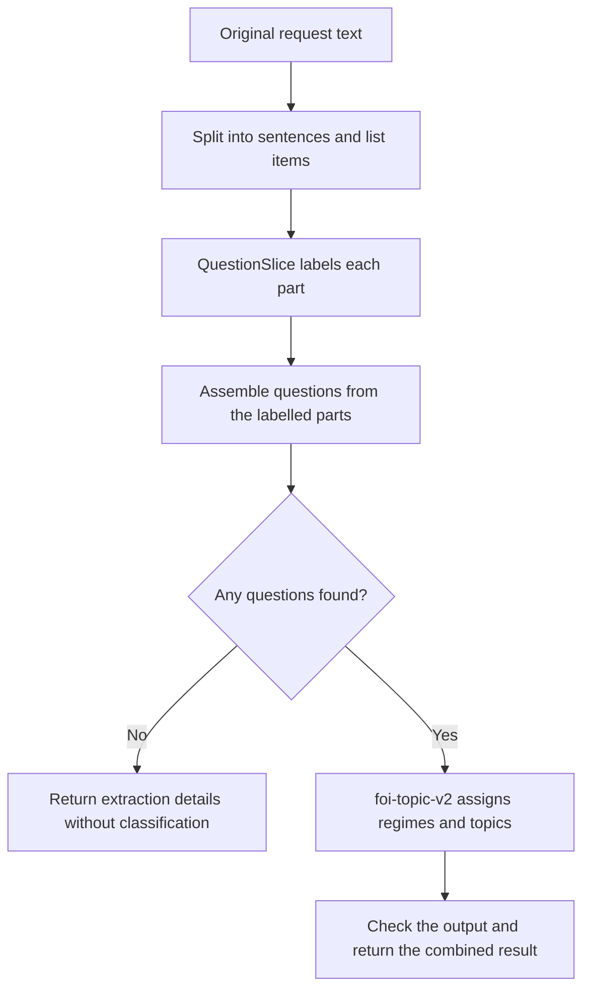

# How the information-request pipeline works

This package turns a piece of correspondence into a list of requests for information, then gives each one a subject and an access regime. 

Two fine-tuned models do different jobs: **QuestionSlice finds the questions** and **foi-topic-v2 classifies them**. QuestionSlice is built on ModernBERT; foi-topic-v2 is built on Granite. We use these task-specific names throughout this guide; `foi_topic_v2` is the corresponding deployment name in configuration. A “question” can be an instruction such as “Please provide the report”; it does not need a question mark.



## Which fine-tuned models are used?

The model names below are Hugging Face repository IDs. They identify the trained files to load. The Exoscale deployment names are shorter names used by this application to find or start a remote instance.

| Job | Model repository | Exoscale deployment |
|---|---|---|
| Find and group requests for information | `mySociety/modernbert-question-slice-v2` | `question_slice_v2` (when using GPU extraction) |
| Assign access regimes and topics | `mySociety/granite-tiny-foi-topic-grounded-v2-merged` | `foi_topic_v2` |

**QuestionSlice** is the fine-tuned ModernBERT classifier trained to assign the four labels described below. CPU and Exoscale extraction use this same checkpoint: CPU runs the whole model, while Exoscale runs its encoder and the API runs its original classification layer. The default local model/tokenizer revision is `eb0436d4be96f113f35b5f891f9cc876a0f0bd6b`. These long revision IDs identify specific versions of the model files.

**foi-topic-v2**, the merged fine-tuned Granite model, contains both the original model and the changes learned during fine-tuning. It was created from the base model `ibm-granite/granite-4.0-1b` (revision `6a7381ba1f54d684ff508d991aeb7dc580157103`) and the LoRA adapter `mySociety/granite-tiny-foi-topic-grounded-v2` (revision `200b756850c137c255f2e6c5c24474edd894d010`). The `-merged` repository is the model used for inference.

Keep the remote import and local model/tokenizer versions aligned when updating either model. For that reason, Exoscale extraction returns `extraction_revision: null` rather than claiming a verified remote revision.

[model_spec.py](model_spec.py) records the default model identities and pinned revisions. [settings.py](../settings.py) provides the QuestionSlice model/revision overrides and deployment names; [exoscale.toml](../../../conf/exoscale.toml) defines the remote models and GPU settings. The `v2` and `grounded-v2` strings are parts of the trained model names, not separate API versions.

## 1. Split the request into manageable parts

[question_slice.py](question_slice.py) joins wrapped lines where appropriate, keeps list items together, and splits ordinary prose into sentences. Each part gets a numbered position, starting at zero, so we can record where a question came from.

For each part, we show QuestionSlice the previous part, the current part and the next part. This gives it context without asking it to process the whole letter at once. The formatting follows what the model saw during training.

This step returns a `list[SemanticUnit]`. Each `SemanticUnit` contains the part’s `index`, its `text`, and a `kind` of `sentence` or `list_item`. These are positions in the split request, not character offsets.

## 2. Decide what each part is doing

QuestionSlice assigns one of four labels:

| Label | Meaning |
|---|---|
| `QUESTION_START` | Starts a new request for information |
| `QUESTION_CONTINUATION` | Continues an earlier request |
| `ADDITIONAL` | Supporting text kept separately from the questions |
| `IGNORE` | Text left out of the questions, such as a greeting |

We keep the model's probabilities and chosen label. The returned `confidence` is the probability of that label, not a calibrated guarantee that it is correct. List items are classified too: a contextual bullet need not become a question, and several items can be grouped into one question.

[backends.py](backends.py) controls where this work happens:

- **CPU**, the default: the whole QuestionSlice model runs in the API process.
- **Exoscale**: the main part of QuestionSlice runs on a remote GPU. It returns numeric representations of the text, and the model's small final classification layer runs locally to produce the labels. This split is needed because the managed gateway exposes embeddings rather than a classification endpoint.

The `backend` choice affects extraction only. foi-topic-v2 runs on Exoscale in both cases.

The label decisions are represented as a `list[UnitPrediction]`. Each `UnitPrediction` contains the original `SemanticUnit`, the chosen `UnitLabel`, its `confidence`, and the probabilities for all four labels. The backend initially returns numeric probability rows; the extraction code validates these and builds the Pydantic objects.

## 3. Assemble the questions

Each start opens a new question; continuations join the most recent question. We build question text from the selected parts and assign IDs such as `q1` and `q2`. We also retain the source-part numbers, additional text and ignored text.

There is one recovery rule for this dataset: **if there are no question starts anywhere, but there is a continuation, treat the first continuation as a start**. This can recover a request that the model recognised but labelled incorrectly. It can also combine separate asks, so it is a heuristic rather than a certainty.

If a start exists elsewhere, a continuation before it remains unresolved. The result is marked `uncertain`. If neither starts nor continuations exist, the result is `no_questions_found` and foi-topic-v2 is skipped. Otherwise the result is `questions_found`.

The original labels and orphan-continuation positions remain in the response, even after recovery. `promoted_continuation_index` records which part was promoted. This explains why a successful result can still contain original orphan positions.

The extraction stage returns a `QuestionSliceResult`, which is also the response from `/agents/foi_structure/extract`. Its `questions` field is a list of `ExtractedQuestion` objects: each has a `question_id`, reconstructed `text`, and `unit_indices` linking it to the original parts. The result also includes the extraction status, raw `UnitPrediction` objects, additional/ignored text, recovery details and extraction model information.

## 4. Classify the extracted questions with foi-topic-v2

[granite.py](granite.py) sends the original request and extracted questions to the merged, fine-tuned foi-topic-v2 checkpoint. Its training adapter is already incorporated into the model; no separate adapter is loaded during a request.

For each question, foi-topic-v2 returns:

- An access regime: `FOI` (Freedom of Information), `EIR` (Environmental Information Regulations), or `SAR` (subject access to personal data).
- A short topic describing the subject of the question.

It also returns a list of topics for the request as a whole. For example, “Please provide the latest air pollution monitoring report” might receive `EIR` and a topic such as “Air pollution monitoring”. These are model predictions.

foi-topic-v2 is constrained to return the expected JSON structure. We then check that question IDs match the extracted questions in order, regimes are allowed, topics are nonblank, and request-level topics are unique. Incomplete or invalid output is an error. Classification does not erase an `uncertain` extraction status.

The classification stage returns a `TopicOutput`. Its `questions` field contains `TopicQuestion` objects with a `question_id`, `regime` and `topic`; its `request_topics` field is a list of topic strings for the whole request. `TopicQuestion` does not repeat the source text: use its ID to find the corresponding `ExtractedQuestion`.

The full pipeline returns an `InformationRequestResult`. This extends `QuestionSliceResult` with the original `request_text`, the `TopicOutput` in `classification`, and `classification_model`. If there are no extracted questions, those last two fields are null. These Pydantic models are defined in [schemas.py](schemas.py); over HTTP they are returned as JSON.

## Limits and waiting

Inputs that exceed model limits are rejected rather than silently shortened. QuestionSlice allows 768 tokens per context window. foi-topic-v2 allows a 2,048-token prompt and up to ten questions under the current output-budget rule. Tokens are pieces of text used by models, not necessarily whole words. These limits live in [model_spec.py](model_spec.py).

Local model work runs outside the async event loop, and remote calls are awaited, so one request waiting for foi-topic-v2 does not block all other requests. CPU classification accepts one in-flight request per model instance; additional calls receive a busy response and should retry. This is not a background batch queue. Remote deployments are created or resumed when needed and use the application's existing idle-scaling lifecycle.

## Prepare both deployments before a batch

For batches using Exoscale extraction, call `POST /deployment-groups/foi_pipeline/ensure` before submitting requests. The `foi_pipeline` group in [exoscale.toml](../../../conf/exoscale.toml) contains `question_slice_v2` and `foi_topic_v2`. The endpoint starts or resumes them concurrently, so their startup waits overlap. It does not run inference or change the order of extraction and classification within a request.

A known group returns HTTP 200 with an overall `success` flag and a `deployments` list containing each member's `slug`, `success`, `replicas` and `error`. Check the flags before starting the batch: one member can fail while another succeeds. Failed members have null `replicas`; successful members have null `error`. Unknown groups return 404. The usual API authentication applies.

Successful deployments are left running if another member fails, and you can retry the group call. Warm-up resets each member's idle timer but does not reserve it indefinitely; normal idle scaling still applies. For CPU extraction, only foi-topic-v2 needs a remote deployment, so use `POST /deployments/foi_topic_v2/ensure` instead. Ordinary requests still start deployments on demand if you do not warm them first.

## Where to start reading or calling the code

[pipeline.py](pipeline.py) brings these steps together:

- `extract_questions()` runs extraction only.
- `process_information_request()` runs extraction followed by classification.

Both are async functions that can also be called from batch code. They receive access to the application's deployment lookup, startup and activity tracking. The HTTP wrappers in [server.py](../server.py) expose them as:

- `POST /agents/foi_structure/extract?backend=cpu`
- `POST /agents/foi_structure?backend=cpu`

Both accept `{"request": "Your correspondence here"}`. Use `backend=exoscale` for remote extraction.

[schemas.py](schemas.py) defines the results. The full result contains the original request, reconstructed questions, extraction diagnostics and foi-topic-v2 classification. `extraction_model`, `extraction_revision` and `extraction_backend` describe the extraction stage. `classification_model` identifies the merged model used for classification. When no questions are found, `classification` and `classification_model` are both null.

## Example: process a batch with async Python

This example runs from an environment with this project installed (for example, `poetry run python batch.py`). Start the API separately, set `LLM_API_URL` to its address, and optionally set `LLM_API_TOKEN` to one of its configured bearer-token values. The token belongs to this API, not Exoscale. The example starts with `list[str]`, warms both remote deployments, then allows up to four requests at a time. Provisioning uses a longer timeout because waking a deployment can take several minutes.

```python
import asyncio
import os

import httpx

from llm_management.foi.schemas import InformationRequestResult


async def process_batch(
    requests: list[str], *, concurrency: int = 4
) -> list[InformationRequestResult | BaseException]:
    if concurrency < 1:
        raise ValueError("concurrency must be at least 1")
    if not requests:
        return []

    token = os.getenv("LLM_API_TOKEN")
    headers = {"Authorization": f"Bearer {token}"} if token else {}
    async with httpx.AsyncClient(
        base_url=os.getenv("LLM_API_URL", "http://localhost:5000"),
        headers=headers,
        timeout=httpx.Timeout(180.0, connect=10.0),
    ) as client:
        warmup = await client.post(
            "/deployment-groups/foi_pipeline/ensure",
            timeout=httpx.Timeout(900.0, connect=10.0),
        )
        warmup.raise_for_status()
        readiness = warmup.json()
        # HTTP 200 can still contain individual deployment failures.
        if not readiness["success"]:
            failed = [m for m in readiness["deployments"] if not m["success"]]
            raise RuntimeError(f"Deployment warm-up failed: {failed}")

        slots = asyncio.Semaphore(concurrency)

        async def process_one(text: str) -> InformationRequestResult:
            async with slots:
                response = await client.post(
                    "/agents/foi_structure",
                    params={"backend": "exoscale"},
                    json={"request": text},
                )
                response.raise_for_status()
                return InformationRequestResult.model_validate(response.json())

        # Wait for every item; keep individual errors alongside successful results.
        return await asyncio.gather(
            *(process_one(text) for text in requests), return_exceptions=True
        )


async def main() -> None:
    requests: list[str] = [
        "Please provide the latest air pollution monitoring report.",
        "Please provide the number of FOI requests received last year.",
        "Thank you for your response.",
    ]
    results = await process_batch(requests)
    for index, result in enumerate(results):
        if isinstance(result, BaseException):
            print(f"Request {index} failed: {result}")
            continue
        print(f"Request {index}: {result.extraction_status}")
        if result.classification is not None:
            for question in result.classification.questions:
                print(question.question_id, question.regime, question.topic)


if __name__ == "__main__":
    asyncio.run(main())
```

Results stay in the same order as the input strings, even when requests finish in a different order. The semaphore limits active HTTP requests; the remaining tasks wait in this client process. This is an in-memory batch, not a durable queue. The example collects per-request errors without automatic retries, so successful requests can be retained while failed ones are inspected or retried. A successful HTTP response may still have an extraction status of `uncertain` or `no_questions_found`.

The group call ensures remote deployments are running; it does not preload the API's local tokenizers and classification layer, so the first inference request can still take longer. Deployments follow normal idle scaling after the batch. The example does not scale them down explicitly because other clients may be using them.

## Example: process a batch with Ruby

This version uses Ruby's standard `net/http`, `json` and thread libraries, so no extra gems or Python installation are needed. Use the same `LLM_API_URL` and optional `LLM_API_TOKEN` environment variables as above, then run `ruby batch.rb`. A fixed pool of worker threads processes an `Array<String>` from a queue, allowing HTTP requests to overlap while limiting concurrency. Each HTTP request has its own connection, so workers do not share a `Net::HTTP` session.

```ruby
require "net/http"
require "json"
require "uri"
require "thread"


def post_json(path, body: nil, read_timeout: 180)
  base_url = ENV.fetch("LLM_API_URL", "http://localhost:5000")
  uri = URI("#{base_url.sub(%r{/+$}, '')}#{path}")
  request = Net::HTTP::Post.new(uri)
  request["Accept"] = "application/json"
  token = ENV["LLM_API_TOKEN"]
  request["Authorization"] = "Bearer #{token}" if token && !token.empty?
  unless body.nil?
    request["Content-Type"] = "application/json"
    request.body = JSON.generate(body)
  end

  response = Net::HTTP.start(
    uri.host, uri.port,
    use_ssl: uri.scheme == "https",
    open_timeout: 10,
    read_timeout: read_timeout,
    write_timeout: 30
  ) { |http| http.request(request) }

  unless response.is_a?(Net::HTTPSuccess)
    raise "HTTP #{response.code} from #{uri.path}"
  end
  JSON.parse(response.body)
end


def process_batch(requests, concurrency: 4)
  unless concurrency.is_a?(Integer) && concurrency.positive?
    raise ArgumentError, "concurrency must be a positive integer"
  end
  return [] if requests.empty?

  readiness = post_json("/deployment-groups/foi_pipeline/ensure", read_timeout: 900)
  unless readiness.fetch("success")
    failed = readiness.fetch("deployments").reject { |member| member.fetch("success") }
    raise "Deployment warm-up failed: #{failed.inspect}"
  end

  queue = Queue.new
  requests.each_with_index { |text, index| queue << [index, text] }
  worker_count = [concurrency, requests.length].min
  worker_count.times { queue << nil } # One stop marker per worker.
  results = Array.new(requests.length)
  result_lock = Mutex.new

  workers = Array.new(worker_count) do
    Thread.new do
      while (item = queue.pop)
        index, text = item
        result = begin
          post_json("/agents/foi_structure?backend=exoscale", body: { request: text })
        rescue StandardError => error
          error # Keep this item's failure and continue with the queue.
        end
        result_lock.synchronize { results[index] = result }
      end
    end
  end
  workers.each(&:value) # Wait for all workers; surface unexpected worker errors.
  results
end


if $PROGRAM_NAME == __FILE__
  requests = [
    "Please provide the latest air pollution monitoring report.",
    "Please provide the number of FOI requests received last year.",
  ]

  process_batch(requests).each_with_index do |result, index|
    if result.is_a?(StandardError)
      warn "Request #{index} failed: #{result.message}"
      next
    end
    puts "Request #{index}: #{result.fetch('extraction_status')}"
    classification = result["classification"]
    next if classification.nil?

    classification.fetch("questions").each do |question|
      puts [question.fetch("question_id"), question.fetch("regime"), question.fetch("topic")].join(" | ")
    end
  end
end
```

As in the Python example, results retain input order and individual failures do not discard successful results. Warm-up failure stops the batch before inference is submitted. Successful responses are parsed Ruby hashes with string keys, rather than Pydantic objects; this example relies on the API's response validation and does not perform equivalent client-side schema validation. The queue is in memory, there are no automatic retries, and normal deployment idle scaling still applies.
